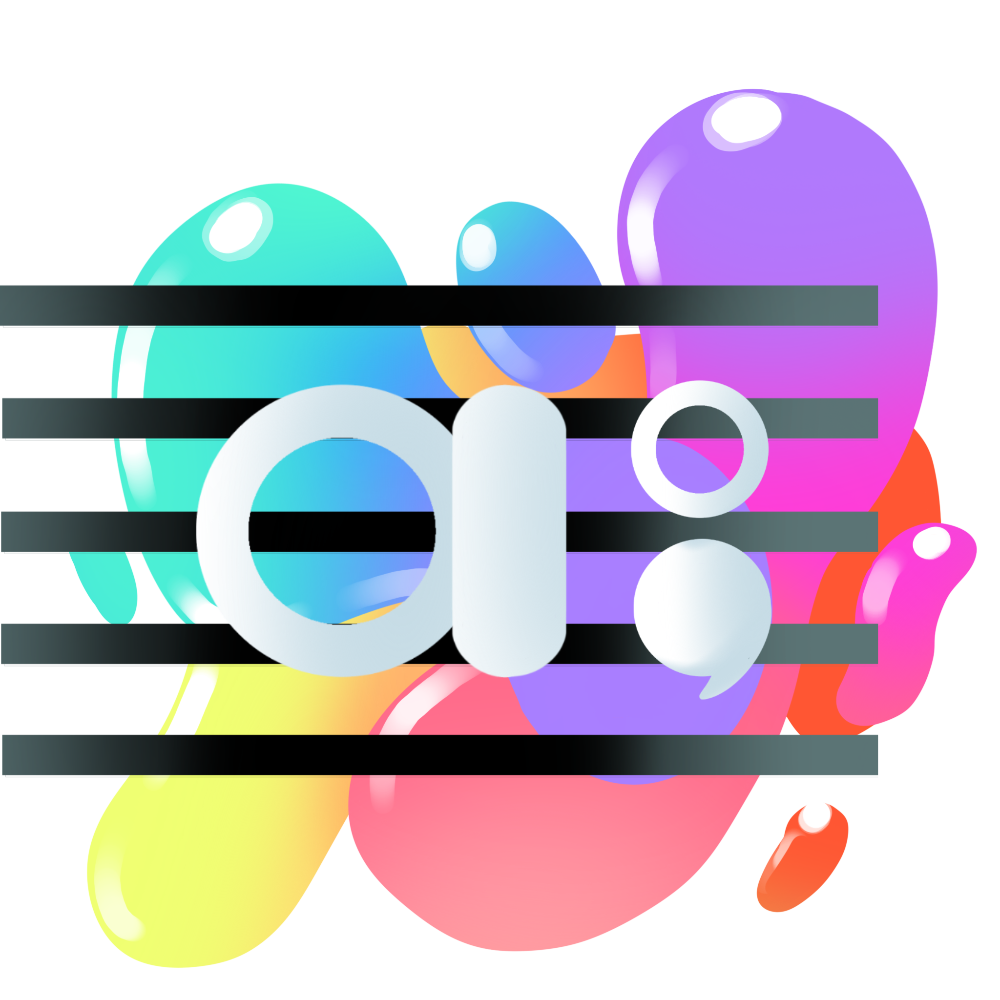

# Adagio

**Demo Link**: https://adagio-app.herokuapp.com/

# Description

-Developed a full stack web application that incorporates music, colors, and journaling to promote a healthy state of mind.

-Allow users select a list of emotionally assigned colors and leave a response to daily inspirational lyrics.

-Users can receive a list of music recommendations based on how they feel on a particular day.

-Used Musixmatch API and Spotify playback SDK to incorporate music functionality and music playback capabilities.

-Allows users to create/edit/delete journals and forum posts, interact with other users’ journals and posts.

-Users can follow other user's activity if they so choose.

# GIFs

Login page and inspirational lyric of the day.

Music recommendations based on how you feel
during the day.

Journal Entry features, and user profiles.

Forum post features.

# Credits

Designed by Vivian Li and developed by Patrick Liang.